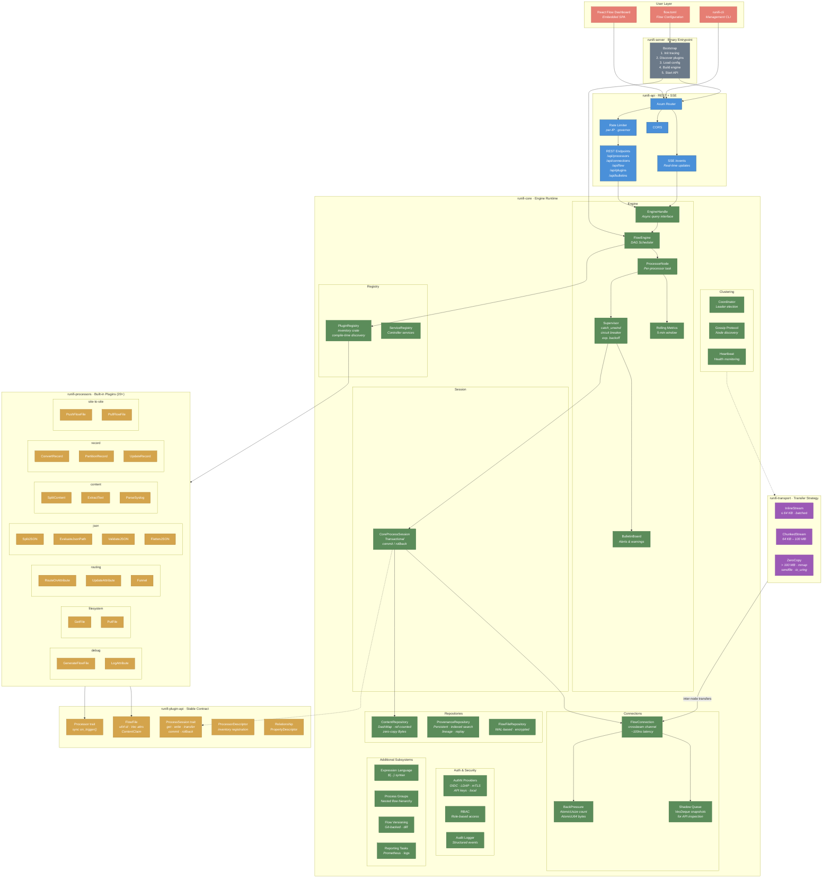
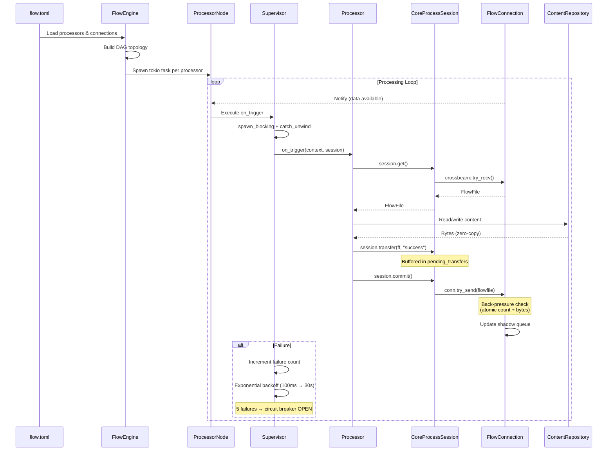
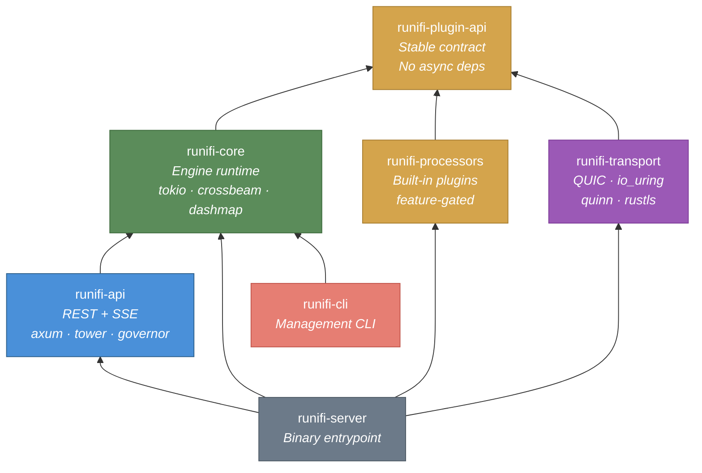
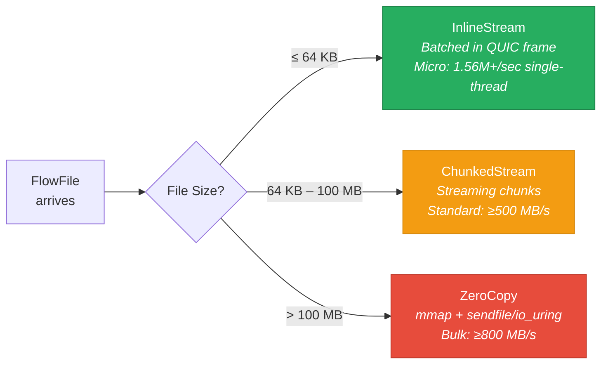
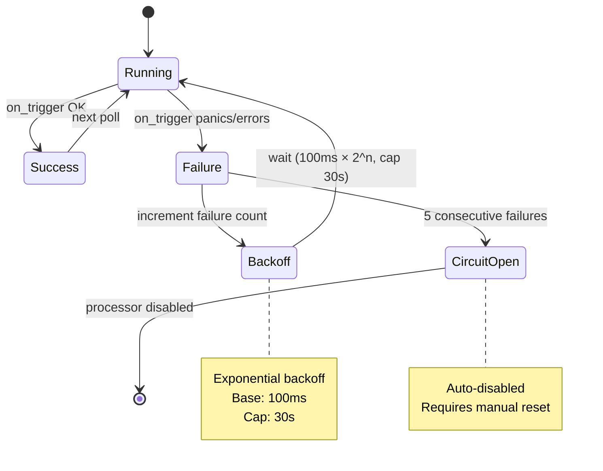

# RuniFi Architecture

## System Overview

## Data Flow Pipeline

## Crate Dependency Graph

## Transfer Strategy Selection

## Fault Tolerance Model

## Engine Performance (Single-Thread Benchmarks)

These numbers reflect the overhead of RuniFi's core primitives, measured with `criterion` on a single thread:

| Operation | Time | Throughput |
|---|---|---|
| FlowFile creation (empty) | ~4 ns | 250M/sec |
| FlowFile creation (3 attributes) | ~20 ns | 50M/sec |
| ID generation (u64 atomic) | 1.65 ns | 606M/sec |
| Attribute lookup (16 attrs) | 5.35 ns | 187M/sec |
| FlowFile clone (8 attrs) | 63 ns | 15.8M/sec |
| Connection send+recv cycle | 48 ns | 20.8M/sec |
| Back-pressure check | 0.64 ns | 1.5B/sec |
| Content create 5KB | 232 ns | 4.3M/sec |
| Content read 5KB (zero-copy) | 28.7 ns | 34.8M/sec |
| Zero-copy slice 1KB from 1MB | 29 ns | 34.5M/sec |
| Full pipeline step (5KB create+write+read+transfer+commit) | 643 ns | 1.56M/sec |
| Pipeline with connection (end-to-end 5KB) | 7.49 µs | 133K/sec |
| Batch create 100 FlowFiles | 18.9 µs | 5.28M FF/sec |
| Session rollback with content | 435 ns | 2.3M/sec |

Run benchmarks: `cargo bench --package runifi-core`

## Subsystem Details

### Authentication & Authorization

RuniFi supports multiple authentication providers chained together:
- **OIDC** — OpenID Connect for SSO integration
- **LDAP** — directory-based authentication
- **mTLS** — mutual TLS client certificate authentication
- **API keys** — programmatic access
- **Local** — username/password with bcrypt hashing

Role-based access control (RBAC) governs all API operations.

### Clustering

Multi-node clustering with:
- **Leader election** — Raft-inspired coordinator selection
- **Gossip protocol** — decentralized node discovery and state propagation
- **Heartbeat** — health monitoring with configurable intervals
- **Dynamic membership** — nodes can join and leave without downtime
- **Load-balanced connections** — distribute FlowFiles across cluster nodes

### Data Provenance

Full lineage tracking for every FlowFile:
- **Persistent repository** — append-only file-backed storage
- **Indexed search** — query by FlowFile ID, processor, time range, or event type
- **Lineage graphs** — trace a FlowFile's full history through the flow
- **Replay** — re-queue FlowFiles from any provenance event

### Expression Language

NiFi-compatible `${...}` syntax for dynamic property values:
- Attribute references: `${filename}`, `${mime.type}`
- String functions: `${filename:toLower()}`, `${path:append('/output')}`
- Conditional logic: `${fileSize:gt(1024):ifElse('large','small')}`

### Flow Versioning

Git-backed version control for flow definitions:
- Automatic snapshots on flow changes
- Diff between versions
- Rollback to any previous version

### Process Groups

Hierarchical flow organization:
- Nested processor groups with independent scheduling
- Input/output ports for inter-group communication
- Breadcrumb navigation in the dashboard
